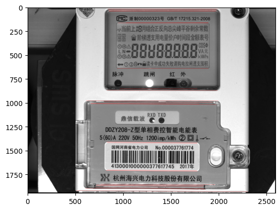
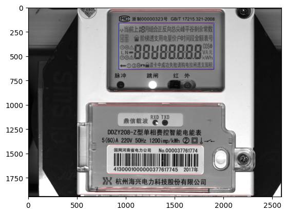
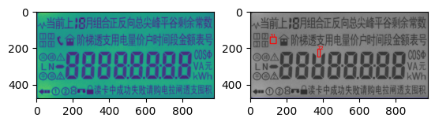

# defect-detecting
基于LSD算法模板匹配缺陷检测

## 电表缺陷检测

[文件](https://github.com/yunke120/defect-detecting/blob/main/meter_defect_detection.ipynb)

### 具体思路

**1 准备文件**

- 模板图片
- 测试图片
- 缺陷位置文件

**2 代码实现思路**

1. 通过LSD算法检测测试图片中的线条，分离出长直线

   

2. 根据直线的斜率通过旋转仿射变化对原图像进行矫正

   

3. 通过模板匹配找出相似度最大的值，确定roi区域

   

4. 根据缺陷位置文件逐一计算每个要检测缺陷位置的标准差，通过设定阈值来得到缺陷位置

   

### 总结

只能检测“有”和“无”的缺陷。
